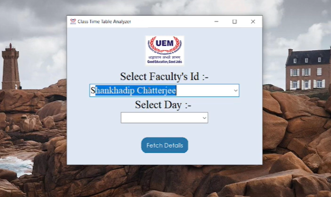
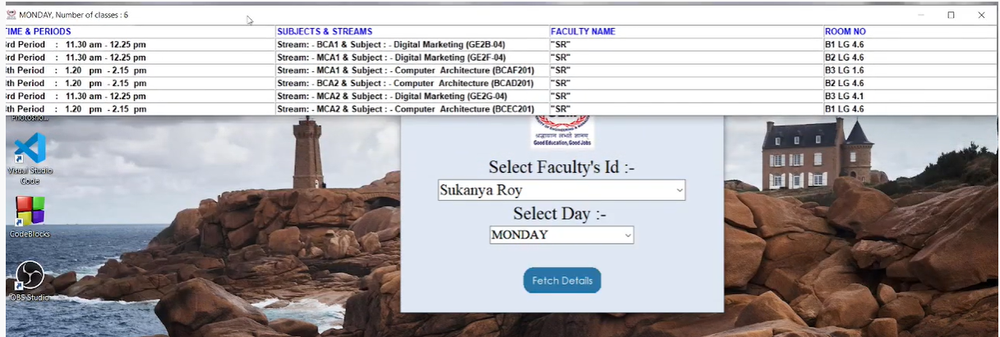
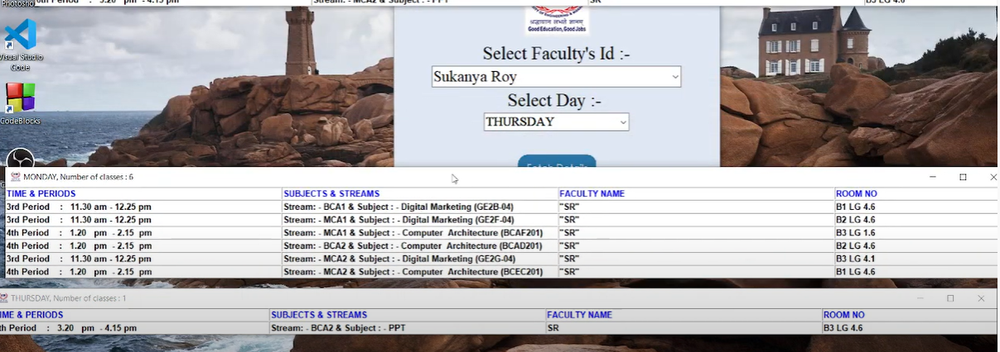
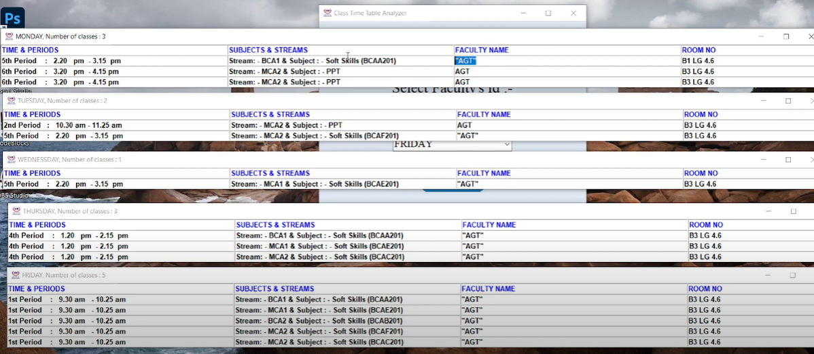

# ROUTINE-ANALYSER :star_struck: :open_mouth: :computer: :book:

[](https://shields.io/) [](https://shields.io/)
<br>

***This new Routine Analyser using Python is created by Biswarup Bhattacharjee, student of BTECH, in University of Engineering and Management, Kolkata.***

**Email Id: bbiswa471@gmail.com.** 

**Contact No: 916290272740.** 


<p align="left">
<a href="https://www.facebook.com/profile.php?id=100070395300810" target="blank"></a>
<a href="https://instagram.com/biswarup2210" target="blank"></a>
<a href="https://github.com/biswa2210" target="blank"></a>
</p>

## About :point_down: 

<div align="justified">

Routine analyser is a python application for faculties. It is used to search routine according to time. Here is a search engine where faculty member can write his or her name and the day of the week. Then the routine is shown. Time, class, subject etc details are shown. These details are read from excell sheet by python.

</div>

## ROUTINE ANALYSER DEMO VIDEO: :point_right: <a href="https://www.youtube.com/watch?v=SsKXFCSfQgw&list=PL0lbDlMJ1h4ikgkbohDuJurlnFvGzJCMr&index=1">Click here to watch</a>

## PYTHON PLAYLIST: :point_right: <a href="https://www.youtube.com/watch?v=SsKXFCSfQgw&list=PL0lbDlMJ1h4ikgkbohDuJurlnFvGzJCMr">Click here to watch</a>

## Purpose :point_down:

<div align="justified">

I have made this for as a work for our HOD sir in innovation cell in our University.

</div>

## Importance :point_down:

<div align="justified">

Faculty members can easily search their routine.

</div>

## Folder Structure :point_down:

```bash
ROUTINE-ANALYSER
    ├── DataSearching.py
    ├── GET-RESULT-DISPLAY.py
    ├── accessXLsx.py
    ├── main.py
    └── tkinter_custom_nutton.py
```
    
## Screenshots :point_down: 

<div align="center">
    
<a href="rou1.png"></a>
    
<a href="rou2.png"></a>

<a href="rou3.png"></a>

<a href="rou4.png"></a>

</div>


